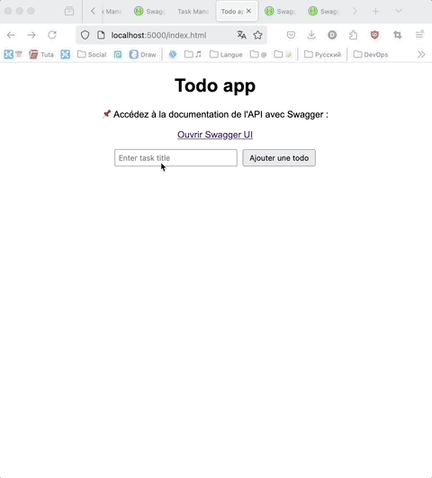

## Todo app C# .NET




Backend en .NET 8 (API REST avec ASP.NET Core)

Base de données SQLite

Frontend en HTML, CSS et JavaScript vanilla

Déploiement sur Azure ou autre hébergement

```
dotnet new webapi -n TaskManagerAPI
cd TaskManagerAPI
```
```
dotnet add package Microsoft.EntityFrameworkCore.Sqlite
dotnet add package Microsoft.EntityFrameworkCore.Design
dotnet add package Swashbuckle.AspNetCore
```
```
dotnet tool install --global dotnet-ef
```
```
dotnet ef migrations add InitialCreate
dotnet ef database update
```
```
dotnet run
```

